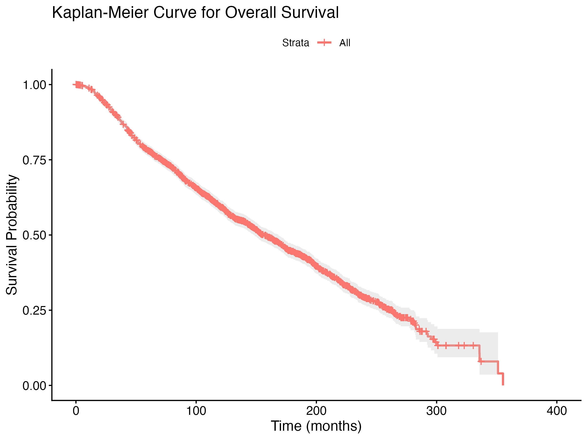

# Breast Cancer Survival Analysis


## Overview

This repository presents an end-to-end survival analysis pipeline using clinical breast cancer data. The project was developed incrementally from scratch to build a practical understanding of each stage of a survival analysis workflow in R — from raw data preprocessing to advanced modeling, diagnostics, validation, and interactive visualization.

The analysis focuses on time-to-event outcomes and combines statistical rigor with clinically meaningful interpretation.

---

## Live Dashboard

Interactive Shiny dashboard:  
**[Breast Cancer Survival Dashboard](https://rrahul.shinyapps.io/breast-cancer-survival-dashboard/)**

The dashboard allows interactive exploration of:
- Overall Survival (OS) and Relapse-Free Survival (RFS)
- Kaplan–Meier curves and log-rank tests
- Adjusted Cox proportional hazards models
- Proportional hazards diagnostics
- Model comparison and validation
- Penalized Cox regression
- Random Survival Forest results
- Calibration analysis
- Filtered cohort-level data summaries

---

## Representative Result



*Kaplan–Meier estimate of overall survival in the breast cancer cohort.*

---

## Goal

To build a deep, practical understanding of survival analysis by systematically implementing:

- Data inspection and cleaning  
- Kaplan–Meier survival estimation  
- Log-rank hypothesis testing  
- Cox proportional hazards modeling  
- Proportional hazards diagnostics  
- Model comparison and validation  
- Advanced modeling (time-varying effects, penalization, machine learning)  
- Interactive communication through a Shiny dashboard  

---

## Dataset

Clinical breast cancer patient-level dataset containing:

- Overall Survival (OS)  
- Relapse-Free Survival (RFS)  
- Treatment variables (chemotherapy, radiotherapy, hormone therapy)  
- Prognostic markers (age, lymph nodes, Nottingham Prognostic Index)  
- Molecular and clinical subtypes  

### Survival Endpoints

**Overall Survival (OS)**  
- Time: `OS_MONTHS`  
- Event: `OS_EVENT` (1 = death, 0 = censored)

**Relapse-Free Survival (RFS)**  
- Time: `RFS_MONTHS`  
- Event: `RFS_EVENT` (1 = relapse, 0 = censored)

---

## Analysis Pipeline

### Task 1–2: Data Inspection & Cleaning
- Loaded and structured the raw clinical dataset  
- Handled missing values and variable types  
- Created survival-ready datasets:
  - `clean/os_data.csv`
  - `clean/rfs_data.csv`

---

### Task 3: Kaplan–Meier Analysis
- Estimated survival curves for OS and RFS  

**Key Observations:**
- Overall survival declines gradually  
- Relapse occurs earlier than death  
- Early-phase differences may be clinically meaningful  

---

### Task 4: Log-Rank Testing
- Compared survival across groups  

**Results:**
- ER status: not statistically significant  
- Hormone therapy: significant  

**Insight:**
- Treatment-related grouping appeared more strongly associated with survival than receptor status alone in unadjusted analysis  

---

### Task 5–6: Cox Proportional Hazards Model
- Fitted a multivariable Cox model  

**Significant predictors:**
- Age at diagnosis  
- Lymph node involvement  
- Nottingham Prognostic Index (NPI)  
- Chemotherapy  
- Radiotherapy (protective association)  
- HER2 subtype  

**Performance:**
- C-index ≈ 0.665  

**Clinical insight:**
- Disease severity dominates survival outcomes  
- Treatment effects should be interpreted cautiously because of confounding by indication  

---

### Task 7: Proportional Hazards Diagnostics
- Tested the PH assumption using Schoenfeld residuals  

**Results:**
- Significant violations for multiple predictors  
- Global test highly significant  

**Conclusion:**
> The baseline Cox model is not fully valid under the proportional hazards assumption

---

### Task 8: Stratified Cox Model
- Stratified by ER status and chemotherapy  

**Results:**
- Improved model performance (C-index ≈ 0.672)  
- Better handling of categorical PH violations  

---

### Task 9: PH Diagnostics After Stratification
- Re-tested the PH assumption  

**Findings:**
- Reduced violations  
- Remaining issues in continuous variables such as age and NPI  

---

### Task 10: Time-Varying Cox Model
- Modeled time-dependent effects using `tt()`  

**Results:**
- Significant time-varying effects for:
  - Age  
  - NPI  
- Improved performance:
  - C-index ≈ **0.677** (best model)  

**Key Insight:**
> Hazard ratios are not constant over follow-up time — risk evolves dynamically

---

### Task 11: Model Comparison

| Model | C-index |
|------|--------|
| Baseline Cox | ~0.665 |
| Stratified Cox | ~0.672 |
| Time-varying Cox | ~0.677 |

**Insight:**
- Addressing model assumptions improves both validity and predictive performance  
- The time-varying Cox model provides the most realistic representation of risk in this dataset  

---

### Task 12: Penalized Cox Regression
- Applied LASSO for feature selection  

**Results:**
- Stable predictors included:
  - Age  
  - Lymph nodes  
  - NPI  
  - Treatment variables  
  - HER2 subtypes  

**Insight:**
> Core predictors remain stable under regularization

---

### Task 13: Random Survival Forest
- Applied a machine learning survival model  

**Results:**
- Top predictors:
  - Age  
  - Lymph nodes  
  - NPI  
- Performance:
  - C-index ≈ 0.667  

**Insight:**
- Machine learning confirmed the importance of core prognostic variables  
- It did not outperform a well-specified Cox framework  

---

### Task 14: Calibration Analysis
- Evaluated predicted versus observed survival probability  

**Results:**
- The model overestimates survival probability  
- The calibration curve lies below the ideal line  

**Insight:**
> Good discrimination does not guarantee good calibration

---

## Key Takeaways

- Survival data often violate standard modeling assumptions  
- Risk is dynamic rather than constant over time  
- Model validation is as important as model fitting  
- Core predictors are robust across:
  - Cox models  
  - Penalized models  
  - Machine learning models  
- Increased complexity does not necessarily produce better clinical prediction  

---

## Project Structure

```text
breast-cancer-survival-analysis/
│
├── app.R            # Shiny dashboard
├── scripts/         # R scripts for each analysis step
├── raw/             # raw dataset
├── clean/           # cleaned datasets
├── results/         # outputs (figures, tables, models)
├── notes/           # learning journal + interpretations
├── README.md

## Learning Approach

This project is built incrementally with a focus on:

- Statistical understanding  
- Reproducible workflows  
- Clinical interpretation  

Each step is documented with:
- Code  
- Reasoning  
- Insights  

---

## Author

**Rahul**

- MSc Medical Statistics & Health Data Science  
  *(University of Bristol, UK)*  
- MSc Statistics  
  *(Indian Institute of Technology Kanpur, India)*  

---

## Project Vision

This project aims to go beyond textbook survival analysis by:

- Addressing real-world modeling challenges  
- Integrating diagnostics and validation  
- Combining statistical and machine learning approaches  
- Building an interpretable and reproducible pipeline  

---